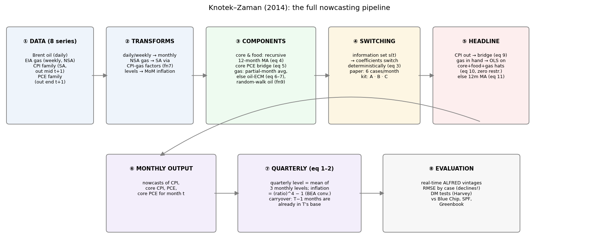

# Knotek–Zaman (2014): Methodology, in My Own Words

*Author: Yi. Written during the design-decision review (July 2026), one section per stop, after answering WHAT/WHY from memory. Figures generated in `methodology_review.ipynb` → `figs/`.*

## The model in ten sentences (capstone — written last)

*(to be written at the capstone, after reconstructing the pipeline from scratch)*

---

## 0. The big picture — the whole pipeline

```mermaid
flowchart LR
    subgraph DATA["① Eight data series"]
        OIL["Brent oil — daily"]
        GASW["EIA retail gasoline — weekly, NSA"]
        CPIF["CPI family (headline, core, food, gas) — monthly SA, out mid t+1"]
        PCEF["PCE family (headline, core) — monthly, out end t+1"]
    end
    subgraph TRANS["② Transforms"]
        T1["daily / weekly → monthly averages"]
        T2["NSA gas → SA, via CPI-gas seasonal factors (fn 7)"]
        T3["levels → month-over-month inflation"]
    end
    subgraph COMP["③ Component nowcasts"]
        MA["core CPI · core PCE · food: recursive 12-month MA (eq 4)"]
        BR["core PCE bridged from released core CPI (eq 5, 24m window)"]
        GAS["gasoline: partial-month weekly average; if none, oil-ECM (eqs 6–7, 60m) with random-walk oil (fn 9)"]
    end
    SW{"④ Information set s(t) → deterministic case switching (eq 3)
paper: 6 monthly / 14 quarterly cases · kit: A / B / C"}
    subgraph HEAD["⑤ Headline"]
        E9["CPI released, PCE not → bridge (eq 9)"]
        E10["gasoline in hand → OLS on core + food + gas hats (eq 10, 24m, zero restrictions)"]
        E11["no gasoline yet → 12-month MA (eq 11)"]
    end
    OUT["⑥ Monthly nowcasts: CPI · core CPI · PCE · core PCE"]
    Q["⑦ Quarterly: mean of 3 monthly levels, then ^4 (eqs 1–2, BEA convention)"]
    EV["⑧ Evaluation: real-time vintages · RMSE by case · DM tests · vs Blue Chip / SPF / Greenbook"]

    DATA --> TRANS --> COMP --> SW --> HEAD --> OUT --> Q --> EV
```

---

## 1. The problem: why nowcast inflation at all

*(to be written by Yi after stop 1)*

## 2. Why decompose headline into core + food + gasoline

*(to be written by Yi after stop 2)*

## 3. Why a recursive 12-month moving average for core and food

*(to be written by Yi after stop 3)*

## 4. Why gasoline gets its own structural block (weekly data + oil ECM)

*(to be written by Yi after stop 4)*

## 5. Why CPI-based seasonal factors instead of X-13

*(to be written by Yi after stop 5)*

## 6. Why bridge equations work, and why eq (10) has zero restrictions

*(to be written by Yi after stop 6)*

## 7. Why short rolling windows (24 and 60 months)

*(to be written by Yi after stop 7)*

## 8. The information-state machine: six cases, deterministic switching

*(to be written by Yi after stop 8)*

## 9. The quarterly layer: average levels, annualize, carryover

*(to be written by Yi after stop 9)*

## 10. Evaluation design — and what the paper deliberately does NOT do

*(to be written by Yi after stop 10)*
